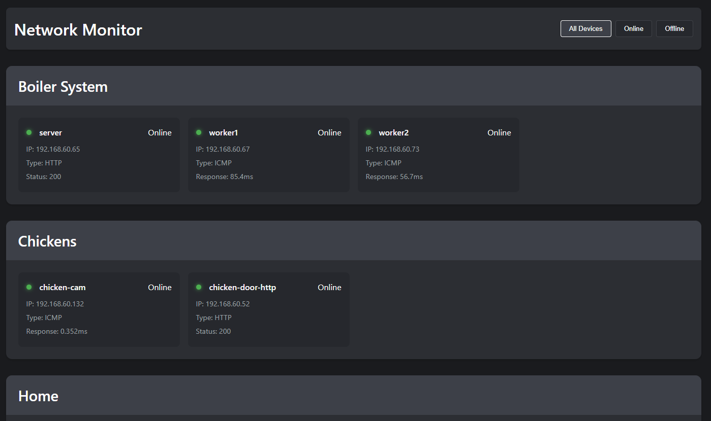
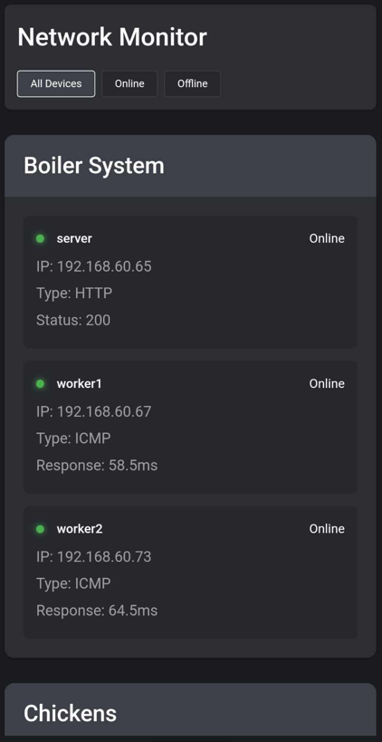

# Local Network Monitor

A simple local network monitoring tool that provides real-time status of configured devices and discovers new devices on your network. Built with **Node.js** and **SQLite**, it offers a web interface for easy monitoring.

## Features

- **Monitor devices** via ICMP (ping) or HTTP endpoints
- **Auto-discover network devices** within configured subnets
- **Real-time updates** via a web interface
- **Device grouping** by sections (e.g., Routers, Servers)
- **MAC address and hostname resolution**
- **Sortable device lists**
- **Persistent SQLite storage** for device data

## Screenshots

### Dashboard


### Mobile View


## Requirements

- **Node.js v16+**
- **npm** (Node Package Manager)
- **sudo access** (for `arp-scan` installation and execution)

## Quick Start

### 1. Install Dependencies

#### Install Node.js dependencies
```bash
npm install
```

#### Install system requirements (for network discovery)
```bash
sudo apt-get install arp-scan
```

### 2. Configuration

#### Copy example config file
```bash
cp config.json.example config.json
```

#### Edit `config.json` to match your network details
```bash
nano config.json
```

##### Example `config.json`
```json
{
  "webPort": 4444,
  "checkInterval": 60,
  "networks": [
    {
      "subnet": "192.168.1.0/24",
      "scanInterval": 300
    }
  ],
  "monitors": {
    "Routers": [
      {
        "name": "Main Router",
        "ip": "192.168.1.1",
        "type": "icmp"
      }
    ],
    "Servers": [
      {
        "name": "Web Server",
        "ip": "192.168.1.10",
        "type": "http",
        "port": 80,
        "endpoint": "/health"
      }
    ]
  }
}
```

### 3. Running the Network Monitor

#### Normal Mode
```bash
sudo npm start
```

#### Debug Mode (Verbose Logging)
```bash
sudo npm run start:debug
```

### 4. Running with PM2 (Process Manager)

#### Install PM2 globally
```bash
sudo npm install -g pm2
```

#### Start the service with PM2

##### Normal Mode
```bash
sudo pm2 start src/server.js --name "network-monitor"
```

##### Debug Mode
```bash
sudo pm2 start src/server.js --name "network-monitor" --env debug
```

#### Make PM2 start on boot
```bash
sudo pm2 startup
sudo pm2 save
```

#### Managing the PM2 Process

- **View logs:**
  ```bash
  pm2 logs network-monitor
  ```
- **Restart service:**
  ```bash
  pm2 restart network-monitor
  ```
- **Stop service:**
  ```bash
  pm2 stop network-monitor
  ```

### 5. Resetting the Database (Fresh Start)
If you want to clear all stored device data and start fresh:
```bash
rm data.db
```

## License
This project is licensed under the **MIT License**.

## Contributions
Feel free to submit pull requests or report issues!

## Contact
For support, contact [your email or GitHub link].

